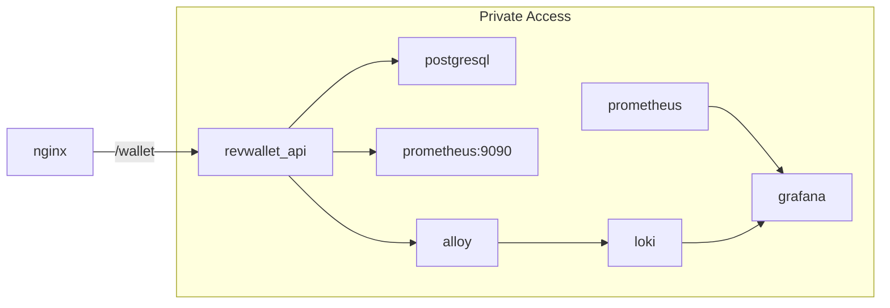

# revwallet
Wallet API where users can deposit, withdraw, and check the balance of a wallet. The objective to practice infrastructure as code, CI/CD, immutable infrastructure, and software development (Python).

## Architecture



## How to run it locally?

```
pipenv shell
pipenv install -e .
docker compose up --build -d  # this will build the images and run the containers
```

Docker Compose will bring up a database container (`revwallet_db`) and the API container (`revwallet_api`). Once the pods are up and running, you can interact with the API:
```
# fetch existing wallets
curl -X GET http://127.0.0.1:5000/wallet/
# example of response: [] or [{"balance":999.0,"currency":"EUR","id":"1","owner":"test2"}]

# create a new wallet
curl -X POST http://127.0.0.1:5000/wallet/ -d '{"owner": "test2", "initial_balance": "999.00", "currency": "EUR"}' -H "Content-Type: application/json"
# example of response: {"balance":999.0,"currency":"EUR","id":"1","owner":"test2"}

# check current balance
curl -X GET http://127.0.0.1:5000/wallet/balance/1
# example of response: {"balance":999.0,"currency":"EUR","id":"1","owner":"test2"}
```

If you want to see the logs of the app, run:
```
docker compose logs revwallet_api --follow
```

To shut everything down, run:
```
docker compose down -v
```

## How to run the tests?
```
pipenv shell
pipenv sync --dev
docker compose up --build -d
pipenv run pytest
```

## How to generate random data?
If you want to generate random data, you can run:
```
bash scripts/generate-data
```

This script will create some wallets, check the balance and fetch all wallets from the API.

## TODO
- [X] Implement unit tests to validate three operations in a wallet: check current wallet balance, deposit money to a wallet and withdraw money from a wallet.
- [X] Implement the wallet API that accepts the three operations above (without persisting anything).
- [X] Add unit tests to CICD.
- [X] Create a simple web app in Flask that can interact with the wallet API to show the current balance in the wallet, add money to it, and withdraw money from the wallet.
- [X] Create a database that will be used to persist all three operations supported by the wallet API.
- [X] Have the DB + the app running locally using Docker.
- [X] Implement integration tests to check if all operations work from end to end.
- [X] Build and publish docker images from GHA
- [X] Implement dashboard for monitoring
- [X] Implement log aggregation
- [ ] Implement code to spin up the minimal infrastructure required to run this in AWS: networking, DB, container orchestrator.
