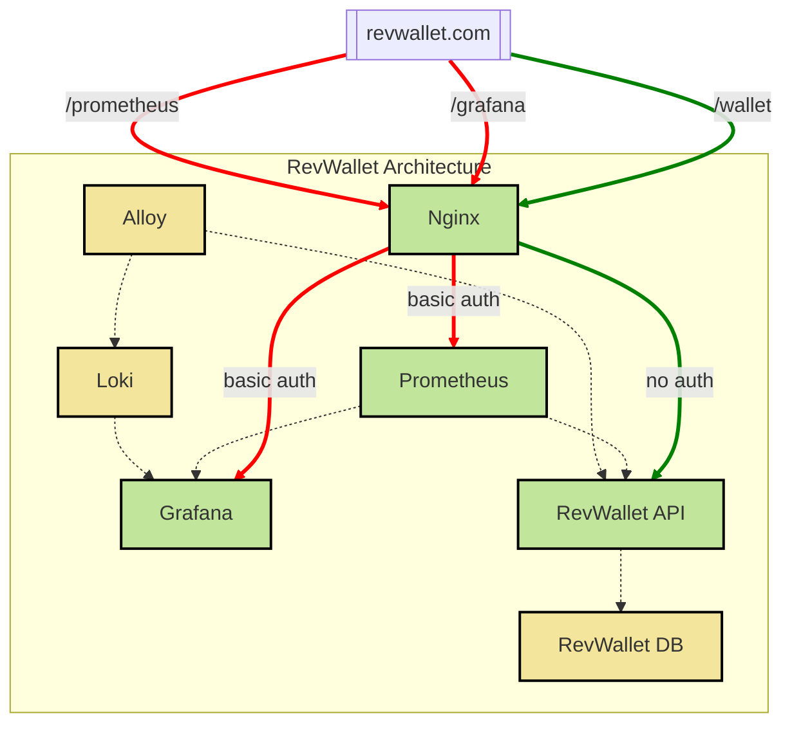

# revwallet
Wallet API where users can deposit, withdraw, and check the balance of a wallet. The objective to practice infrastructure as code, CI/CD, immutable infrastructure, and software development (Python).

## Architecture Overview
The RevWallet API is hosted behind an Nginx reverse proxy. In addition to the API, other key services such as Grafana and Prometheus are also routed through Nginx, ensuring a unified access point for external interactions.


  
Only the services routed through Nginx (RevWallet API, Grafana, and Prometheus) are exposed to external networks. Except for the API, all the other routes through Nginx require basic authentication (`admin:admin` :D). 

Other critical services (e.g., Loki, Alloy, RevWallet DB) are not exposed externally. Their ports are not bound to the local host, maintaining internal-only communication. Services within the architecture communicate exclusively over the application's internal network.

This setup ensures that internal services remain inaccessible from outside the network, which adds an extra layer of security to the system.

## Requirements
RevWallet is a [Flask](https://flask.palletsprojects.com/en/3.0.x/) application that runs on Docker. To get started, ensure you have the following dependencies installed on your system:
- [Docker](https://docs.docker.com/guides/getting-started/)
- [Docker Compose](https://docs.docker.com/compose/gettingstarted/)
- [Kind](https://kind.sigs.k8s.io/docs/user/quick-start/)
- [Kubectl](https://kubernetes.io/docs/reference/kubectl/)
- [Helm](https://helm.sh/docs/intro/quickstart/)
- [Python 3.11](https://www.python.org/downloads/)
- [Pipenv](https://pipenv.pypa.io/en/latest/)

If you use `brew`, you can install the necessary dependencies by running:
```
brew install docker
brew install docker-compose
brew install kind
brew install helm
brew install python@3.11
brew install pipenv
```

Lastly, to ensure that revwallet.com resolves correctly on your local machine, add the following entry to your `/etc/hosts` file:
```
127.0.0.1 revwallet.com
```

## Running RevWallet with Docker Compose
To run RevWallet locally using Docker Compose, follow these steps:

1. Start by activating the virtual environment and installing the dependencies:
```
pipenv shell
pipenv install -e .
```
2. Build the Docker images and run the containers:
```
docker compose up --build -d  # this will build the images and run the containers
```

Docker Compose will bring up all the services. Once the containers are up and running, you can interact with the API as follows:

- Fetch existing wallets
```
curl -L -X GET http://revwallet.com/wallet/
```
Example of response: 
```
[] or [{"balance":999.0,"currency":"EUR","id":"1","owner":"test2"}]
```

- Create a new wallet
```
curl -L -X POST http://revwallet.com/wallet/ -d '{"owner": "test2", "initial_balance": "999.00", "currency": "EUR"}' -H "Content-Type: application/json"
```
Example of response: 
```
{"balance":999.0,"currency":"EUR","id":"1","owner":"test2"}
```

- Check current balance
```
curl -L -X GET http://revwallet.com/wallet/balance/1
```
Example of response: 
```
{"balance":999.0,"currency":"EUR","id":"1","owner":"test2"}
```

### Checking the logs
To see the logs of the app, run:
```
docker compose logs revwallet-api
```

### Shutting Down
To shut everything down, run:
```
docker compose down -v
```

### Running Tests
RevWallet has both unit and end-to-end tests. Follow these steps to run them all:

1. Activate the virtual environment:
```
pipenv shell
```
2. Sync dependencies:
```
pipenv sync --dev
```
3. Build and start the containers:
```
docker compose up --build -d
```
4. Run the tests:
```
pipenv run pytest
```

## Running RevWallet on Kubernetes with `kind` and `helm`
To run RevWallet on Kubernetes (locally), follow these steps:

1. Create a local Kubernetes clusters with `kind`:
```
kind create cluster --name revwallet
kind get clusters
```
2. Create a new namespace:
```
kubectl create namespace revwallet-dev
kubectl config set-context --current --namespace=revwallet-dev
kubectl get pods
```
3. Deploy the database:
```
kubectl apply -f k8s/revwallet-db
```
If you want to make sure the DB is deployed correctly, you can run the following commands to check if resources were created properly:
```
kubectl get pv
kubectl get pvc
kubectl get deployments
kubectl get pods
kubectl get svc
```
You can also connect to the DB:
```
kubectl exec -it <POD> -- psql -h localhost -U revwallet --password -p 5432 revwallet
```
And verify the connection to the DB:
```
\conninfo
```
Expected response:
```
Password:
psql (16.4 (Debian 16.4-1.pgdg120+1))
Type "help" for help.

revwallet=# \connect
Password:
You are now connected to database "revwallet" as user "revwallet".
revwallet=#
```
4. Deploy the API:
```
helm -n revwallet-dev upgrade --install --values k8s/revwallet-api-chart/values.yaml revwallet-api k8s/revwallet-api-chart
```
5. Deploy Nginx:
```
helm repo add bitnami https://charts.bitnami.com/bitnami
helm repo update
kubectl -n revwallet-dev create configmap nginx-html --from-file=config/nginx/revwallet.html --from-file=config/nginx/404.html 
kubectl -n revwallet-dev create configmap nginx-config --from-file=config/nginx/nginx.conf
helm -n revwallet-dev upgrade --install --values k8s/nginx/values.yaml revwallet-proxy bitnami/nginx
```
To access the app, first, run:
```
kubectl -n revwallet-dev port-forward pod/<NGINX_POD> 8080:8080
```
Then, access the app at http://localhost:8080

### Running Tests
TBD.

### Shutting Down
To shut all the pods down in Kubernetes, run:
```
kubectl -n revwallet-dev delete configmap nginx-html
kubectl -n revwallet-dev delete configmap nginx-conf
helm -n revwallet-dev uninstall nginx
helm -n revwallet-dev uninstall revwallet-api
helm -n revwallet-dev uninstall revwallet-db
helm -n revwallet-dev uninstall revwallet-obs
```

To delete the cluster, run:
```
kind delete cluster --name revwallet
```

## Generating Random Data
To generate random data for testing purposes, you can use the [generate-data](./scripts/generate-data) script. Run the following command in your terminal to populate the API with sample data:

```
bash scripts/generate-data
```

This script will:
- Create some wallets.
- Check the balance of these wallets.
- Fetch all wallets from the API.

## TODO
- [X] Implement unit tests to validate three operations in a wallet: check current wallet balance, deposit money to a wallet and withdraw money from a wallet.
- [X] Implement the wallet API that accepts the three operations above (without persisting anything).
- [X] Add unit tests to CICD.
- [X] Create a simple web app in Flask that can interact with the wallet API to show the current balance in the wallet, add money to it, and withdraw money from the wallet.
- [X] Create a database that will be used to persist all three operations supported by the wallet API.
- [X] Have the DB + the app running locally using Docker.
- [X] Implement integration tests to check if all operations work from end to end.
- [X] Build and publish docker images from GHA
- [X] Implement dashboard for monitoring
- [X] Implement log aggregation
- [ ] Run it locally with K8s
- [ ] Implement code to spin up the minimal infrastructure required to run this in AWS: networking, DB, container orchestrator.
