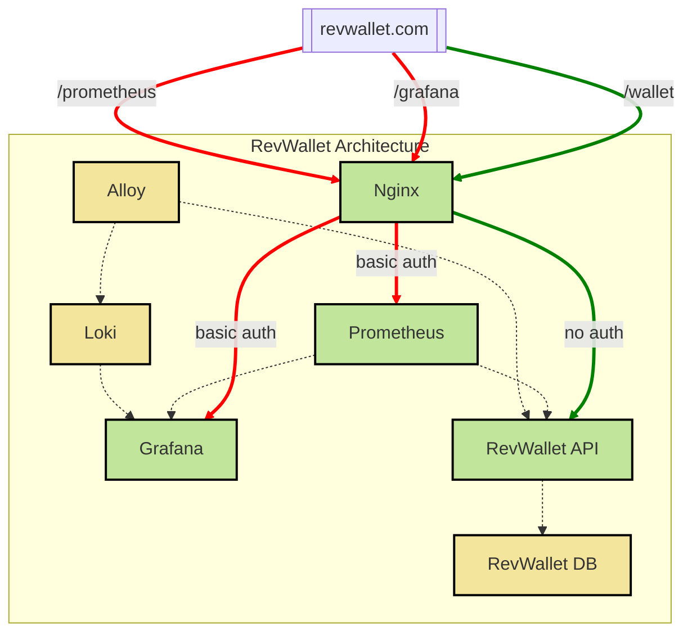
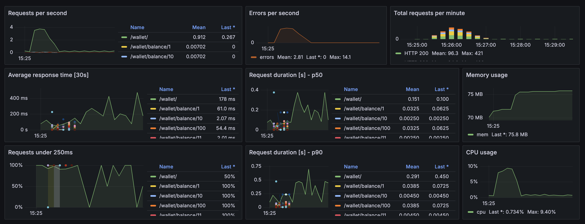

# RevWallet
Wallet API where users can deposit, withdraw, and check the balance of a wallet. 

*The objective to practice infrastructure as code, CI/CD, immutable infrastructure, and software development (Python).*

## Architecture Overview
The RevWallet API is hosted behind an Nginx reverse proxy. In addition to the API, other key services such as Grafana and Prometheus are also routed through Nginx, ensuring a unified access point for external interactions.


  
Only the services routed through Nginx (RevWallet API, Grafana, and Prometheus) are exposed to external networks. Except for the API, all the other routes through Nginx require basic authentication (`admin:admin` :D). 

Other critical services (e.g., Loki, Alloy, RevWallet DB) are not exposed externally. Their ports are not bound to the local host, maintaining internal-only communication. Services within the architecture communicate exclusively over the application's internal network.

This setup ensures that internal services remain inaccessible from outside the network, which adds an extra layer of security to the system.

## Dashboard
RevWallet is shipped with a default dashboard that can be accessed in Grafana:


## Requirements
RevWallet is a [Flask](https://flask.palletsprojects.com/en/3.0.x/) application that runs on Docker. To get started, ensure you have the following dependencies installed on your system:
- [Docker](https://docs.docker.com/guides/getting-started/)
- [Docker Compose](https://docs.docker.com/compose/gettingstarted/)
- [Kind](https://kind.sigs.k8s.io/docs/user/quick-start/)
- [Kubectl](https://kubernetes.io/docs/reference/kubectl/)
- [Helm](https://helm.sh/docs/intro/quickstart/)
- [Python 3.11](https://www.python.org/downloads/)
- [Pipenv](https://pipenv.pypa.io/en/latest/)

If you use `brew`, you can install the necessary dependencies by running:
```
brew install docker
brew install docker-compose
brew install kind
brew install helm
brew install python@3.11
brew install pipenv
```

## Running RevWallet with Docker Compose
To run RevWallet locally using Docker Compose, run:
```
make compose-up
```
Then, access the API at http://localhost:8080

To shut everything down:
```
make compose-down
```

For more details about RevWallet on Docker Compose, refer to the [Docker Compose documentation](docs/docker-compose.md).

## Running RevWallet on Kubernetes (locally)
To deploy RevWallet on Kubernetes (locally), run:

```
make setup   # creates the cluster and namespace
make deploy  # deploys all resources
```

Make sure the API is accessible locally:
```
make port-forward
```

Then, access the API at http://localhost:8080

To shut everything down, run:
```
make stop-port-forward     # stops port forward to nginx
make delete                # deletes resources from K8s cluster
make shutdown              # deletes the k8s cluster
```

For more details about RevWallet on Docker Compose, refer to the [Kubernetes documentation](docs/k8s-kind.md).

## Generating Random Data
To generate random data for testing purposes, you can use the [generate-data](./scripts/generate-data) script. Run the following command in your terminal to populate the API with sample data:

```
bash scripts/generate-data
```

This script will:
- Create some wallets.
- Check the balance of these wallets.
- Fetch all wallets from the API.
