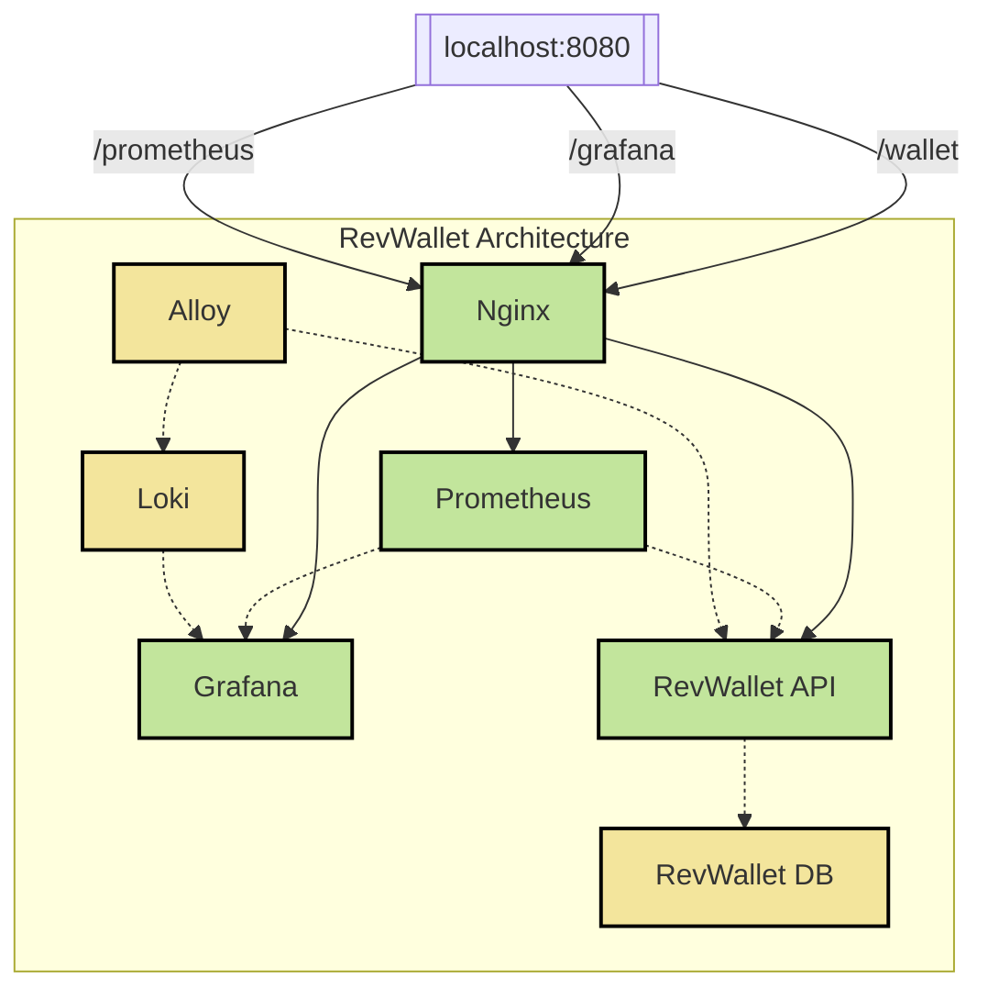

[]([https://github.com/kubernetes/minikube/releases/latest](https://github.com/arthurjguerra/revwallet/releases/latest))

# RevWallet
RevWallet is a wallet API that allows users to deposit, withdraw, and check their balance. It serves as a practice project for infrastructure as code, CI/CD, immutable infrastructure, and Python software development.

## Architecture Overview

The RevWallet API is hosted behind an Nginx reverse proxy. Grafana and Prometheus are also routed through Nginx for unified access.

Only the RevWallet API, Grafana, and Prometheus are exposed externally, with authentication required for the latter two. Internal services like Loki, Alloy, and the database remain accessible only within the internal network.

## Dashboard
RevWallet is shipped with a default dashboard that can be accessed in Grafana:


## Requirements
RevWallet is a [Flask](https://flask.palletsprojects.com/en/3.0.x/) application that runs on Docker. To get started, ensure you have the following dependencies installed on your system:
- [Docker](https://docs.docker.com/guides/getting-started/)
- [Docker Compose](https://docs.docker.com/compose/gettingstarted/)
- [Kind](https://kind.sigs.k8s.io/docs/user/quick-start/)
- [Kubectl](https://kubernetes.io/docs/reference/kubectl/)
- [Helm](https://helm.sh/docs/intro/quickstart/)
- [Python 3.11](https://www.python.org/downloads/)
- [Pipenv](https://pipenv.pypa.io/en/latest/)

To install dependencies via `brew`:
```
brew install docker docker-compose kind helm python@3.11 pipenv
```

## Running RevWallet with Docker Compose
Start the API:
```
make compose-up
```
Then, access the API at http://localhost:8080

Shut down the API:
```
make compose-down
```

For more details, refer to the [Docker Compose documentation](docs/docker-compose.md).

## Running RevWallet on Kubernetes (locally)
Set up and deploy the API:

```
make setup   # creates the cluster and namespace
make deploy  # deploys all resources
```

Make the API accessible locally:
```
make port-forward
```

Access the API at http://localhost:8080

To shut everything down, run:
```
make stop-port-forward     # stops port forward to nginx
make delete                # deletes resources from K8s cluster
make shutdown              # deletes the k8s cluster
```

For more details, refer to the [Kubernetes documentation](docs/k8s-kind.md).

## Generating Random Data
To generate random data for testing purposes, you can use the [generate-data](./scripts/generate-data) script. Run the following command in your terminal to populate the API with sample data:

```
bash scripts/generate-data
```

This script will:
- Create some wallets.
- Check the balance of these wallets.
- Fetch all wallets from the API.
