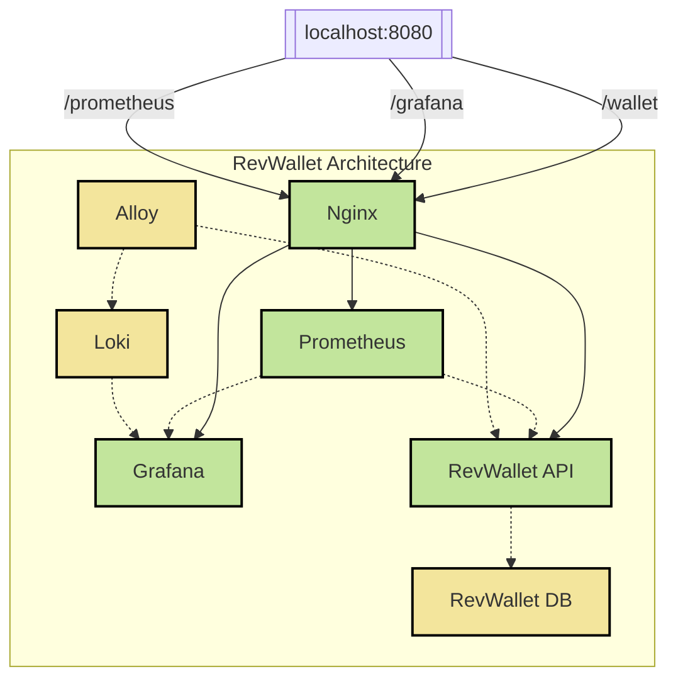
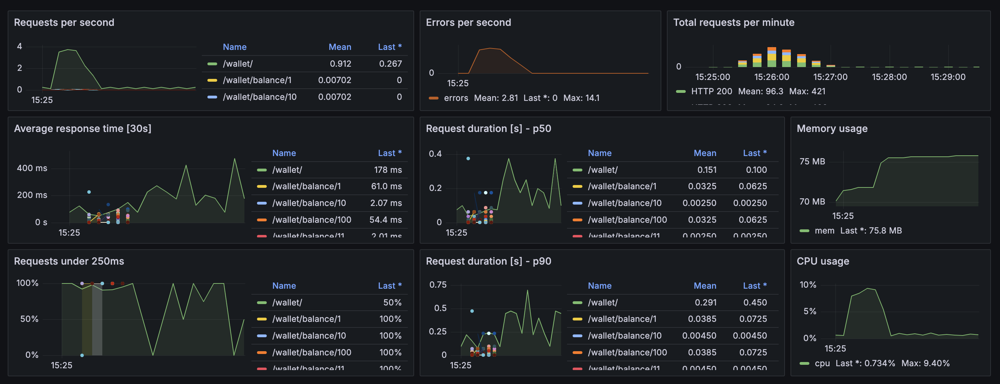
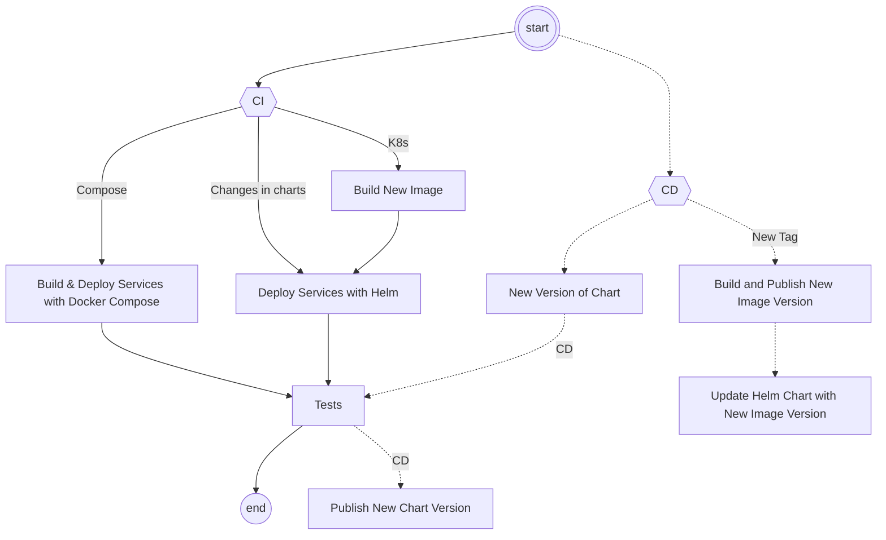

[]([https://github.com/kubernetes/minikube/releases/latest](https://github.com/arthurjguerra/revwallet/releases/latest))

# RevWallet
RevWallet is a wallet API that allows users to deposit, withdraw, and check their balance. It serves as a practice project for infrastructure as code, CI/CD, immutable infrastructure, and Python software development.

## Architecture Overview

The RevWallet API is hosted behind an Nginx reverse proxy. Grafana and Prometheus are also routed through Nginx for unified access.

Only the RevWallet API, Grafana, and Prometheus are exposed externally. Internal services like Loki, Alloy, and the database remain accessible only within the internal network.

## Requirements
RevWallet is a [Flask](https://flask.palletsprojects.com/en/3.0.x/) application that runs on Docker. To get started, ensure you have the following dependencies installed on your system:
- [Docker](https://docs.docker.com/guides/getting-started/)
- [Docker Compose](https://docs.docker.com/compose/gettingstarted/)
- [Kind](https://kind.sigs.k8s.io/docs/user/quick-start/)
- [Kubectl](https://kubernetes.io/docs/reference/kubectl/)
- [Helm](https://helm.sh/docs/intro/quickstart/)
- [Python 3.11](https://www.python.org/downloads/)
- [Pipenv](https://pipenv.pypa.io/en/latest/)

To install dependencies via `brew`:
```
brew install docker docker-compose kind helm python@3.11 pipenv
```

## Running RevWallet with Docker Compose
Start the API:
```
make compose-up
```
Then, access the API at http://localhost:8080

To shut everything down, run:
```
make compose-down
```

For more details, refer to the [Docker Compose documentation](docs/docker-compose.md).

## Running RevWallet on Kubernetes (locally)
Deploy RevWallet to Kubernetes locally:

```
make create deploy
```

Access RevWallet at http://localhost:8080/

To shut everything down, run:
```
make terminate
```

For more details, refer to the [Kubernetes documentation](docs/k8s-kind.md).

## Generating Random Data
To populate the API with sample data, run:

```
make data
```

This command will:
- Create some wallets.
- Check the balance of these wallets.
- Fetch all wallets from the API.

## Observability

### Metrics
RevWallet utilizes the `prometheus-flask-exporter` package to expose basic metrics, including:

- `flask_http_request_duration_seconds`: Duration of Flask HTTP requests in seconds.
- `flask_http_request_total`: Total number of HTTP requests made to Flask.
- `flask_http_request_exceptions_total`: Total number of uncaught exceptions when serving Flask requests.

For more information, refer to the [Prometheus Flask Exporter repository](https://github.com/rycus86/prometheus_flask_exporter).

### Dashboard
RevWallet includes a basic dashboard accessible in Grafana:


## CICD
When a new tag is created, a new version of the RevWallet API chart is released via Github Actions. The Charts are hosted on Github Pages and are publicly available at [ArtifactHub](https://artifacthub.io/packages/helm/revwallet/revwallet-api).



